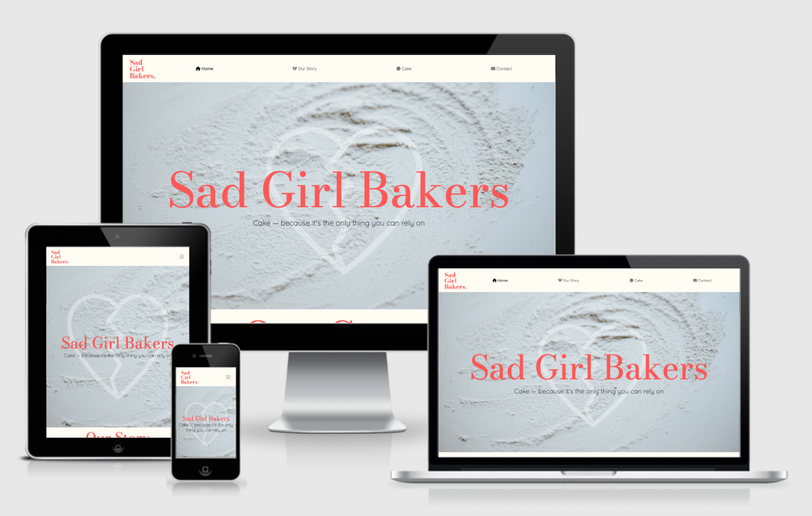
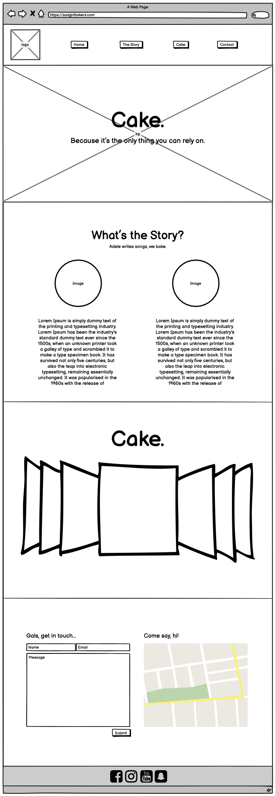
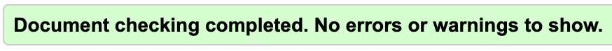
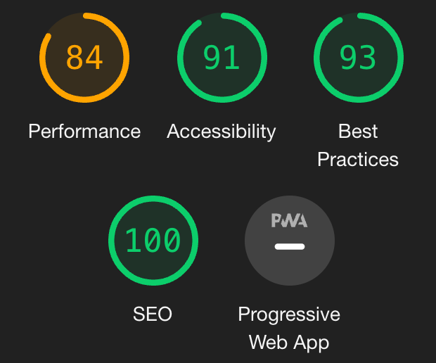

Live site here.

Sad Girl Bakers is a business in the early stages of it's development. The purpose of the website is to support brand identity by providing legitimacy (digital storefront) and to direct the social media followers of the brand to a place where they can learn more about Sad Girl Bakers.

# UX

## User Stories
- As a first-time visitor, I want the user to easily navigate their way through the site, thus seamlessly learning about the brand and the products that they offer. I want users who are loyal to the brand to be able to make contact and engage.

- As a returning visitor, I want to locate information displayed on the site as efficiently as possible. I want to see if there are new bakes and other updates to the site.

- As a frequent user, I want to go straight to contact information.

## Design
- Design Choices
    - The website follows the principles of minimalist design. This style is neatly summed up by Marc Schenker: “minimalism is about designers expressing only the most essential and necessary elements of a product or subject by getting rid of any excessive and, therefore, unnecessary components and features.” For the full article and breakdown of minimalism click [here](https://creativemarket.com/blog/minimalist-design-trend). This design decision was made to further the brand goals of the business and their chosen aesthetic. 
    - A single scroll website was thought appropriate for the goal of providing a clear structure to the information in an order that made the most sense. For example, this design choice allows the story of the brand to be understood before being introduced to the products that they offer.

- Colour Scheme
    - The minimalist two tone design of the website involves colours:  #ff5757 (Sad Girl Bakes Red) and #fffcf4 (Cream).

- Typography
    - The font used for all main headers and the text overlay of the hero image is ‘Bodini Moda’ (in line with the SGB logo) with ‘Quicksand’ as all subtitles. All paragraph text is in ‘Helvetica Neue’. Throughout the site, the back-up font is ‘sans-serif’.

- Imagery
    - Images are used to support the overall aesthetic of the site, chosen to create a smooth and simple style that puts the information front and centre.

- Wireframe

# Features

- Fully responsive — optomised for phone, tablet, laptop and desktop. 
- Interactive carousel and contact page. 

# Technologies Used
## Languages used
 - HTML5
 - CSS

 ## Frameworks, Libraries & Programmes used:
 1.	Bootstrap 5
    - Bootstrap was used to structure the site, utilising the built-in responsiveness for all device types.
2.	Google Fonts
    - The fonts, ‘Bodini Moda’ and ‘Quicksand’ are sourced from Google Fonts.
3.	Font Awesome
    - Icons were used to enhance the UX of the navbar.
4.	Git
    - Git was utilised for version control through ‘commit’ and ‘push’ commands through the terminal.
5.	Github
    - Github was used to store code ‘pushed’ from Gitpod.
6.	Photoshop
    - Photoshop was used for image manipulation, editing and resizing. It was also used in creating the slides for the bootstrap carousel found on the ‘Bakes’ page. 
7.	Balsamiq
    - Balsamiq was used to outline the entire design of the website through wireframes.

# Testing
Both the HTML5 and CSS3 code was put through WSC validators and passed without errors. 
- HTML5 

- CSS3 

- Favourable scores were also obtained through Google lighthouse. 

## Testing User Stories
- As a *first-time visitor*, I want to easily navigate through the site, thus seamlessly learning about the brand and the products that they offer.
    - Upon visiting the site, the user is welcomed with a large hero image with a title to let them know they’re in the right place. Above the hero image there is a clear, uncluttered navigation bar to aid in their exploration. However, the single scroll design of the site encourages a linear path through the site that walks the user through the information in an order that makes the most sense.
- As a *returning visitor*, I want to locate information displayed on the site as efficiently as possible. I want to see if there are new bakes and other updates to the site.
    - With some familiarity to the site, a user can use the navigation bar to go directly to the information they require, when they require it. The user can quickly see if there are content updates by browsing the site. The headings are big and bold allowing the user to know where they are at all times.
- As a *frequent user* I want to go straight to contact information or make contact through social media.
    - The contact form and iframe that locates the business location is linked in the navigation bar and can be found easily.  
    - The footer of the page contains links to all of their social media, allowing the user to engage on multiple platforms and build brand loyalty and synergy accross all of the businesses applications.

    ## Further Testing
    - Browsers
        - Chrome: Performs and displays correctly. 
        - Safari: Performs and displays correctly.
        - Mozilla: Performs and displays correctly.
        - Opera: Performs and displays correctly.
    - Devices
        - MacBook Air 13inch: Performs and displays correctly.
        - iPhone 13 Pro: Performs and displays correctly.
        - iPad Pro: Performs and displays correctly.
        - OnePlus Nord: Performs and displays correctly.
        - LG 27UN83A 4K: Performed well, but paragraph text looked small, and the bakes carousel appeared small on the page.
            - Solution: Added an additional media query for screen widths above 1440px, increasing the size of paragraph text and decreasing the viewport height the bakes section took up.
    - Real World Testing
        - Friends and family members were asked to engage with the site in order to find bugs. No bugs were reported in this testing. Positive feedback was received on the look of the site.

# Next Steps
- Increase the performance of the site to achieve a higher lighthouse score.
- Add a blog to the site to increase SEO and climb the google rankings.
- Add a shop so that customers can make purchases after browsing.

# Deployment

## GitHub Pages
To deploy the site through GitHub pages:
1.	Log in to GitHub and go to the GitHub Repository.
2.	Click on settings (the gear icon).
3.	Scroll down to the GitHub Pages header and click on the ‘Check it out here!’ link.
4.	Under the Source header, from the dropdown menu choose ‘main’. 
5.	After the page refreshes, scroll down to the published website link found under the GitHub pages header.

## Forking the GitHub Repository
To create a copy of the project to experiment with changes in a safe way that will not affect the original site:
1.	Log into GitHub go to the GitHub Repository.
2.	Near the top of the Repository, click the “Fork” button in order to create a copy of the repository. 

## Making a Local Clone
1.	Log into GitHub go to the GitHub Repository.
2.	Click ‘Code’.
3.	To clone the repository using HTTPS, under "Clone with HTTPS", click the clipboard icon to copy the link. 
4.	Open Git Bash. 
5.	Change the current working directory to the location you want the cloned directory.
6.	Type ‘git clone’, add a space, then paste the URL that was copied earlier (step 3) and press enter. This should have created a clone.

For a detailed step-by-step guide with screenshots, click [here](https://docs.github.com/en/repositories/creating-and-managing-repositories/cloning-a-repository#cloning-a-repository-to-github-desktop).

# Credits
## Code
- Bootstrap 5: Bootstrap was used in the development of the site, utilising the responsive grid system and navigation bar.
## Content
- All content written by Joshua Jones (Developer).
- The  example Code Institute Read Me file, on which this Read Me file is based on.
## Media
- All images a part from those used in the 'Our Story' section were sourced from [Unsplash](https://unsplash.com/) — a site that provides images for free for commercial and non-commercial use.
- The images used in the 'Our Story' section were created by the Developer.
## Acknowledgments
- My Mentor, Precious Ijege, for his thoughtful and helpful feedback. 
- Tutor Support, for their invaluable support throughout the entire project. 

